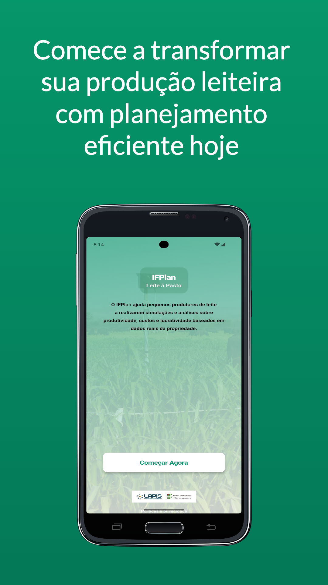
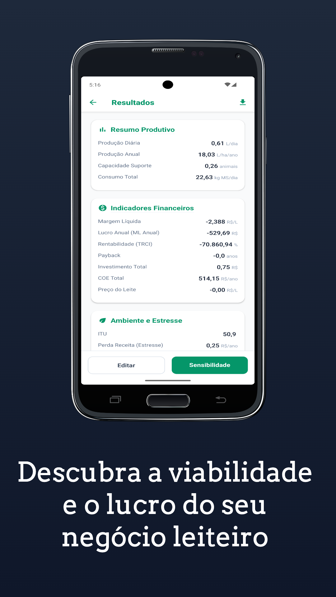
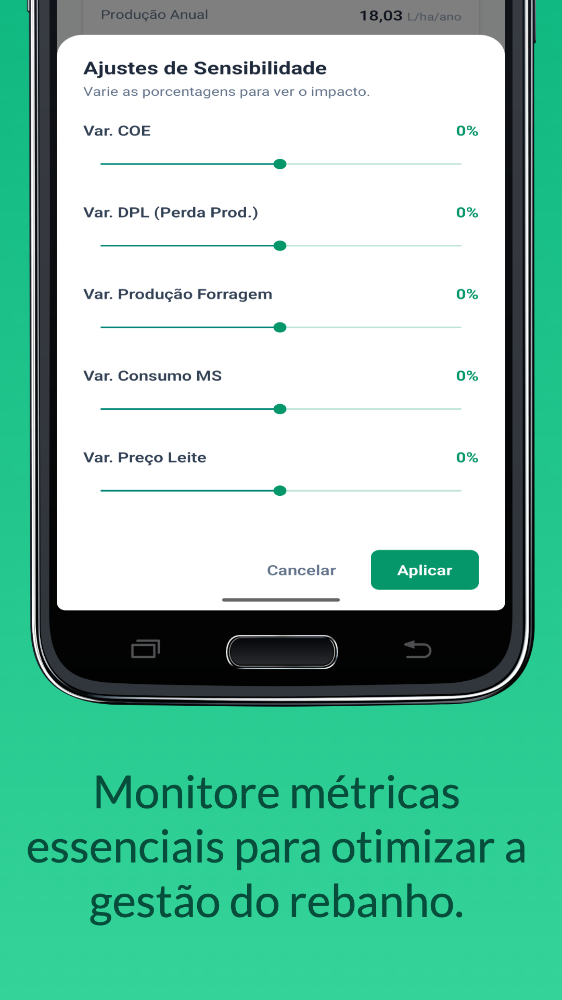

# IFPlan - Leite à Pasto

O **IFPlan Leite à Pasto** é uma solução móvel completa voltada para pequenos produtores de leite. O aplicativo permite realizar simulações técnicas detalhadas que abrangem desde condições climáticas e manejo de pastagens até indicadores econômicos complexos, auxiliando na tomada de decisão estratégica para aumentar a lucratividade e eficiência da propriedade.

## Screenshots

|          |      |
| ------------------------------------------------------------------------------------ | ------------------------------------------------------------------------------------ |
|            |          |
|  |  |

## Principais Funcionalidades

- **Simulações Multidimensionais**: Avaliação de fatores climáticos (temperatura, chuva, umidade), solo, rebanho e gestão econômica.
- **Histórico de Simulações**: Painel intuitivo para gerenciar e comparar diferentes cenários salvos.
- **Fluxo de Onboarding**: Guia inicial para novos usuários entenderem o potencial da ferramenta.
- **Análise de Resultados**: Cálculos automáticos de margem líquida, ponto de equilíbrio, produtividade por área e retorno sobre investimento.
- **Modo Offline**: Total funcionalidade em áreas rurais sem necessidade de conexão constante com a internet.

## Ferramentas Principais

- **Expo**: Framework para desenvolvimento de aplicações universais React.
- **Expo Router**: Roteamento baseado em arquivos para React Native.
- **Zustand**: Gerenciamento de estado leve e escalável.
- **React Hook Form**: Gerenciamento de formulários eficiente com validação.
- **MMKV**: Armazenamento local de alta performance.

## Tecnologias Adotadas

- **React Native**: Criação de interfaces nativas.
- **TypeScript**: Tipagem estática para maior segurança e produtividade.
- **Zod**: Validação de esquemas e tipos.

## Como Executar o Projeto

Certifique-se de ter o ambiente de desenvolvimento React Native configurado em sua máquina.

### Instalação

```bash
yarn install
```

### Executar no Android

```bash
yarn android
```

### Executar no iOS

```bash
yarn ios
```

### Como realizar o build com EAS

- Instale o EAS Cli globalmente. Siga os passos no link: https://docs.expo.dev/
- Deve ter acesso ao Expo dev, ou solicitar ao manager o acesso a plataforma.
  Segue o link do Expo dev: https://expo.dev/accounts/lapislabs-organization
- Depois execute o comando:

```bash
eas build
```

- Escolha a opção de build para Android ou iOS.

### Política de Privacidade

https://ifplanleite.vercel.app/

---

<p align="center">LAPIS IFCE - 2025</p>
